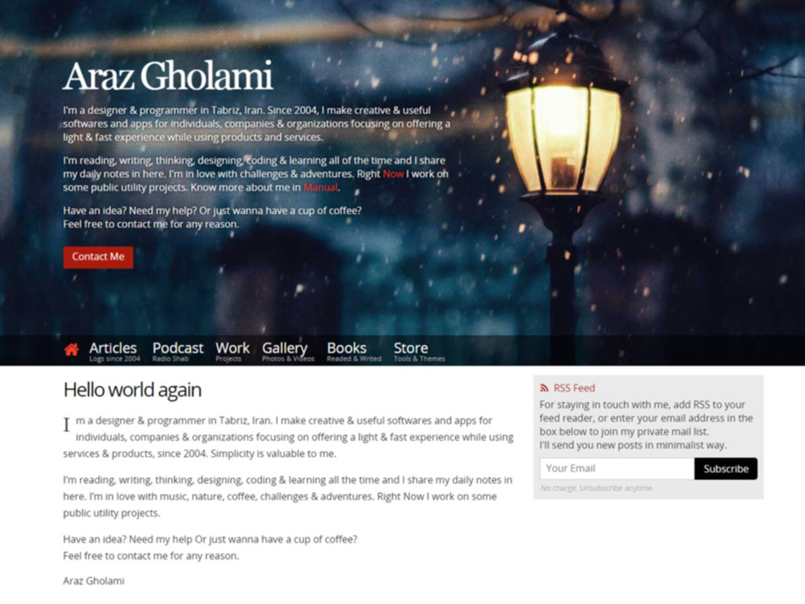

# Rebellion
A minimal &amp; moden wordpress theme

## How to Download
Checkout releases page https://github.com/arazgholami/rebellion/releases

## Contribution
Any contribution are welcome.

## Author
Araz Gholami  
<https://arazgholami.com>

## License
Rebellion is licensed under The MIT License. Which means that you can use, copy, modify, merge, publish, distribute, sublicense, and/or sell copies of the final products. But you always need to state that Araz Gholami is the original author of this theme.

## Contact
Araz Gholami contact@arazgholami.com 

## Changelogs
### v1.3 (Dreaming)
- Add wordpress requirments for publishing in wordpress.org
### v1.2 (To Do)
- More options in options page
- Extract functions as separate plugins
- Leave-Comment layout based on post direction
- Add subscription function
### v1.1
- Added Optional contact button
- Fixed responsive layout bugs
### v1.0
- Minimal, Moden and Responsive Layout
- Perfect typography for both rtl and ltr lanuages
- Minimum size & minimum HTTP request
- Simple Option page for customization
